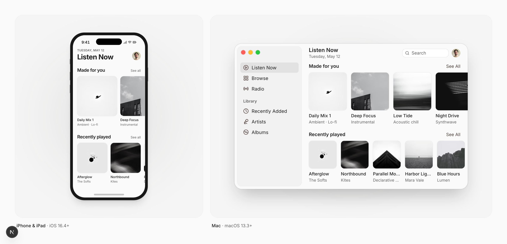

<div align="center">

# swiftui-flx

**SwiftUI components you paste and own.**

A shadcn/ui-style design system for SwiftUI: open source components you add to your app with one command and then own completely.

[Website](https://swiftui.flexnative.com) · [Components](https://swiftui.flexnative.com/docs/components/ios/avatar) · [Installation](https://swiftui.flexnative.com/docs/installation) · [Presets](https://swiftui.flexnative.com/docs/presets)


<picture>
  <source media="(prefers-color-scheme: dark)" srcset="public/images/docs/readme-dark.png">
  
</picture>

</div>

## Why swiftui-flx

swiftui-flx follows the [shadcn/ui](https://ui.shadcn.com) approach: instead of adding a dependency, you add the source to your project. From then on it's your code, ready to adapt to your app.

- **You own the code.** No dependency to update or work around. Change anything.
- **Built on native SwiftUI.** Components wrap `Button`, `Toggle`, `Slider`, `DisclosureGroup` and friends, styled through their own `*Style` protocols, so you keep native behavior.
- **Follows Apple's metrics.** Sizes, spacing and controls follow the Human Interface Guidelines on each platform. A Toggle is a switch on iPhone and a checkbox on Mac.
- **Accessible.** Built with Dynamic Type and VoiceOver in mind.
- **Themes and dark mode.** Every component reads from shared tokens. Switch presets or bring your own colors in one place.
- **iPhone, iPad and Mac.** Docs, previews and examples for each platform.

## Quick start

Using Claude Code, Cursor or Codex? Copy the [Install with AI](https://swiftui.flexnative.com/docs/installation) prompt, or point your agent to [llms.txt](https://swiftui.flexnative.com/llms.txt). Adding to an existing app? See [Existing Projects](https://swiftui.flexnative.com/docs/existing-projects).

Add the foundation once, then the components you need. Run from your app's source folder, or pass `--cwd` ([details](https://swiftui.flexnative.com/docs/installation#where-to-run-the-cli)):

```bash
npx shadcn@latest add https://swiftui.flexnative.com/r/foundation.json --cwd MyApp
npx shadcn@latest add https://swiftui.flexnative.com/r/ios-button.json --cwd MyApp
```

Use `mac-button.json` for macOS. Prefer not to use the CLI? Every component page has the source to [copy by hand](https://swiftui.flexnative.com/docs/installation).

```swift
import SwiftUI

struct SettingsView: View {
    @State private var notifications = true

    var body: some View {
        FLXCard {
            FLXCardHeader {
                FLXCardTitle("Notifications")
            }
            FLXCardContent {
                FLXToggle("Allow notifications", isOn: $notifications)
            }
            FLXCardFooter {
                FLXButton("Save", variant: .primary) {}
            }
        }
    }
}
```

## Components

| Component | iOS & iPadOS | macOS | |
| --- | :---: | :---: | --- |
| [Avatar](https://swiftui.flexnative.com/docs/components/ios/avatar) | ✓ | ✓ | Profile picture with an initials fallback |
| [Badge](https://swiftui.flexnative.com/docs/components/ios/badge) | ✓ | ✓ | Small label for status, category or count |
| [Button](https://swiftui.flexnative.com/docs/components/ios/button) | ✓ | ✓ | Primary, outline, secondary, ghost and link variants |
| [Card](https://swiftui.flexnative.com/docs/components/ios/card) | ✓ | ✓ | Container with header, content and footer |
| [Collapsible](https://swiftui.flexnative.com/docs/components/ios/collapsible) | ✓ | ✓ | Content that expands and collapses |
| [Field Label](https://swiftui.flexnative.com/docs/components/ios/field-label) | ✓ | ✓ | Caption paired with a form control |
| [Form Field](https://swiftui.flexnative.com/docs/components/ios/form-field) | ✓ | ✓ | Label, control, description and error together |
| [Item](https://swiftui.flexnative.com/docs/components/ios/item) | ✓ | ✓ | List, notification and settings rows |
| [Menu](https://swiftui.flexnative.com/docs/components/ios/menu) | ✓ | — | Actions revealed from a button |
| [Picker](https://swiftui.flexnative.com/docs/components/ios/picker) | ✓ | — | Dropdown to pick one value |
| [Progress View](https://swiftui.flexnative.com/docs/components/ios/progress-view) | ✓ | ✓ | Progress bar or spinner |
| [Secure Field](https://swiftui.flexnative.com/docs/components/ios/secure-field) | ✓ | ✓ | Password input |
| [Sheet](https://swiftui.flexnative.com/docs/components/ios/sheet) | ✓ | ✓ | Content presented over the current view |
| [Slider](https://swiftui.flexnative.com/docs/components/ios/slider) | ✓ | ✓ | Pick a value from a range |
| [Text Editor](https://swiftui.flexnative.com/docs/components/ios/text-editor) | ✓ | ✓ | Multi-line text input |
| [Text Field](https://swiftui.flexnative.com/docs/components/ios/text-field) | ✓ | ✓ | Single-line text input |
| [Text Field Group](https://swiftui.flexnative.com/docs/components/ios/text-field-group) | ✓ | ✓ | Text field with leading and trailing addons |
| [Toggle](https://swiftui.flexnative.com/docs/components/ios/toggle) | ✓ | ✓ | Switch on iOS, checkbox on macOS |

On macOS, Menu and Picker use SwiftUI's native versions, which the Mac always draws itself.

## Requirements

- iOS and iPadOS 16.4 or later, or macOS 13.3 or later
- Swift 5 or Swift 6 language mode
- The [shadcn CLI](https://ui.shadcn.com/docs/cli) to install components, or nothing at all if you copy them by hand

## FAQ

**Why not a Swift package?**
Packages are great for shared logic. For UI, having the source lets you shape each component to your app's design and change it whenever you need.

**Do I need a web project or Node?**
Only `npx` to run the shadcn CLI. Nothing from the web ends up in your app. The files are plain Swift.

**Does it work with my existing design?**
Yes. Change the tokens in `DesignSystem/Theme` or apply a preset with `.flxTheme(_:)` to any part of your app.

## Development

This repo powers [swiftui.flexnative.com](https://swiftui.flexnative.com) and hosts the component registry.

```bash
pnpm install
pnpm dev
pnpm registry:build
```

Swift sources live in `registry/`. `pnpm registry:build` generates the installable files in `public/r`. See [CONTRIBUTING.md](CONTRIBUTING.md) to try a change in an app and for the rules every component follows.

## Credits

Inspired by [shadcn/ui](https://ui.shadcn.com). Built by [Felipe Menezes](https://x.com/fmenezes_).

If swiftui-flx saves you time, a star helps other SwiftUI developers find it.

## License

The components and design system in [`registry/`](registry) are licensed under the [MIT license](registry/LICENSE). Use them in any app, commercial or not.

Everything else in this repository, including the website, is licensed under the [AGPL-3.0 license](LICENSE).
